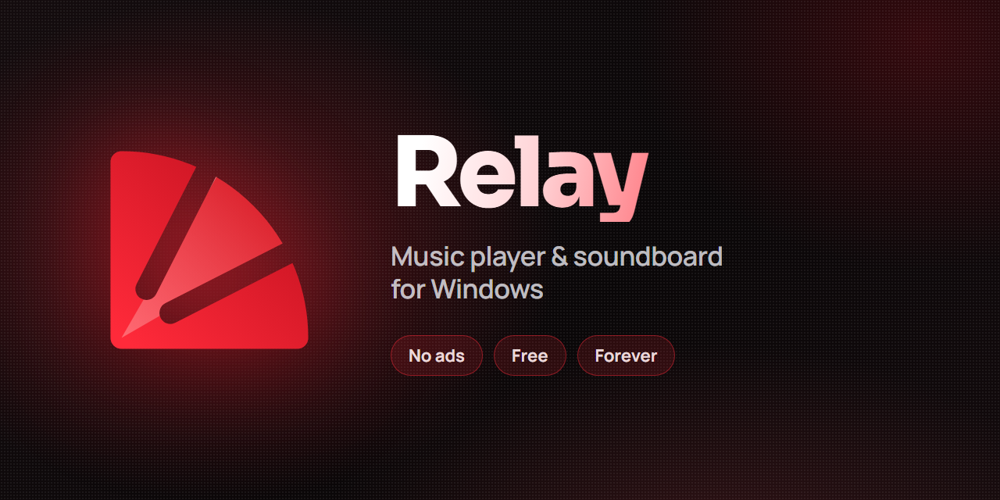

  

  <b><a href="https://elcocosyt.github.io/Relay/">Website</a></b> ·
  <b><a href="https://github.com/ElcocosYT/Relay/releases/latest/download/Relay-Setup.exe">Download for Windows</a></b>

# Relay

Music and Soundboard in the same place, born to be one of the most complete music players.

[**Download Relay for Windows**](https://github.com/ElcocosYT/Relay/releases/latest/download/Relay-Setup.exe) · [**Visit the website**](https://elcocosyt.github.io/Relay/)

Relay updates itself: when a new version comes out, it tells you when you open it.

Made with love by SupperDupper. Free to download and use, with no ads.

## See it live

The [website](https://elcocosyt.github.io/Relay/) shows Relay itself, running in your browser: every screen, with its real design and animations.

## License

© 2026 SupperDupper. All rights reserved.

Relay is free to download and use. Its code, design, artwork and interface are not open source: you may not copy, modify, redistribute or reuse them, in whole or in part, without written permission from SupperDupper.