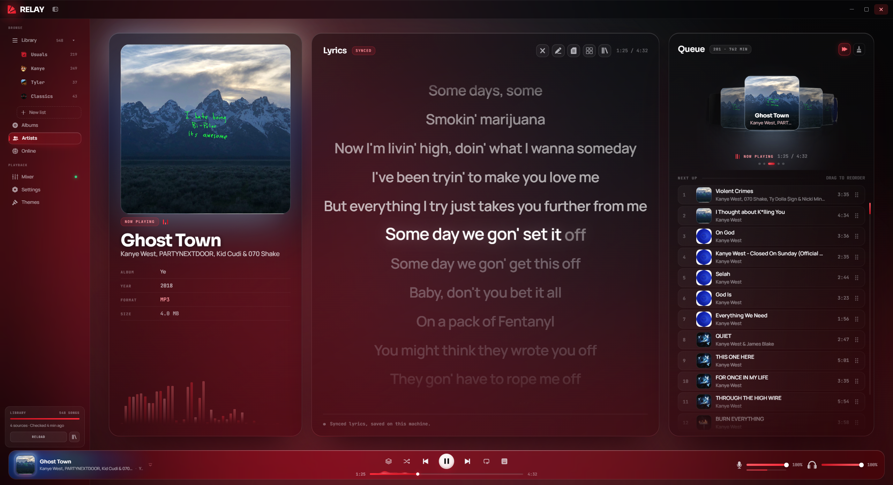
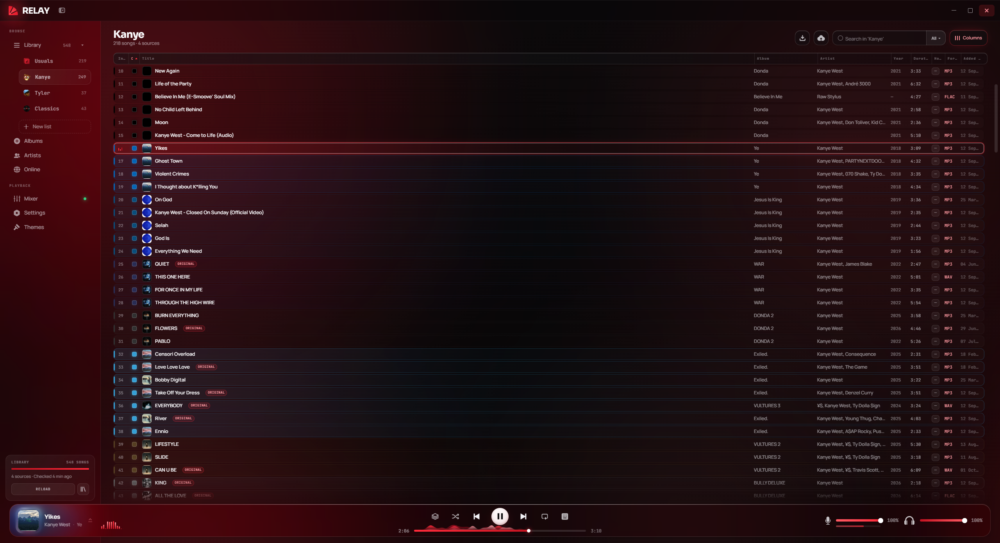
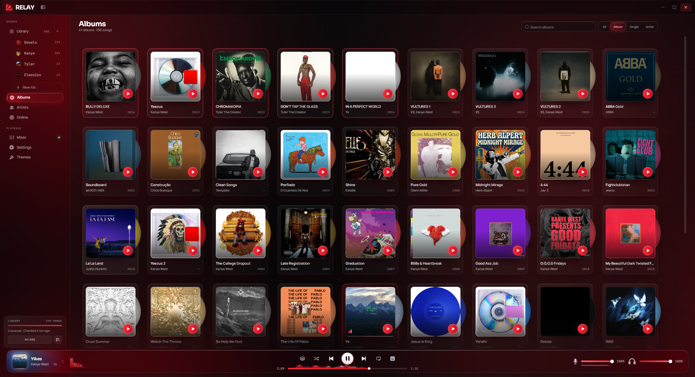
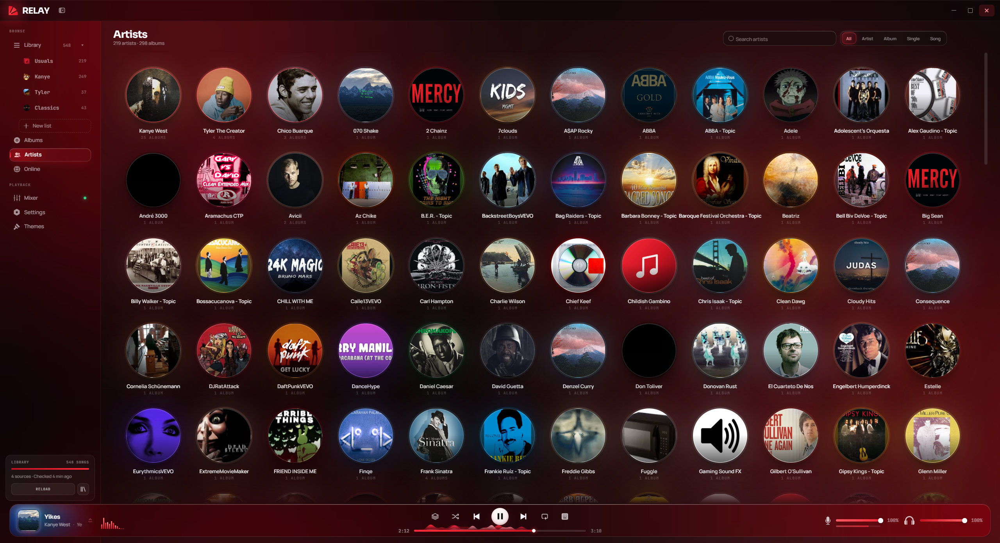
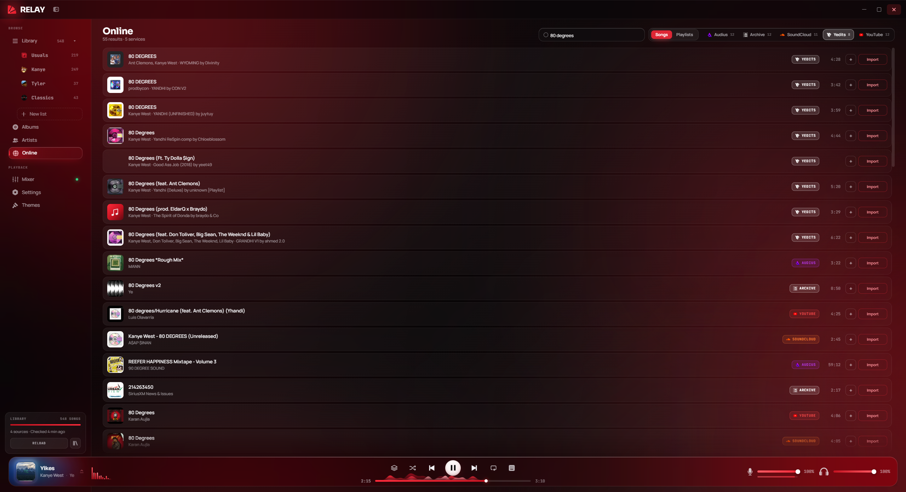
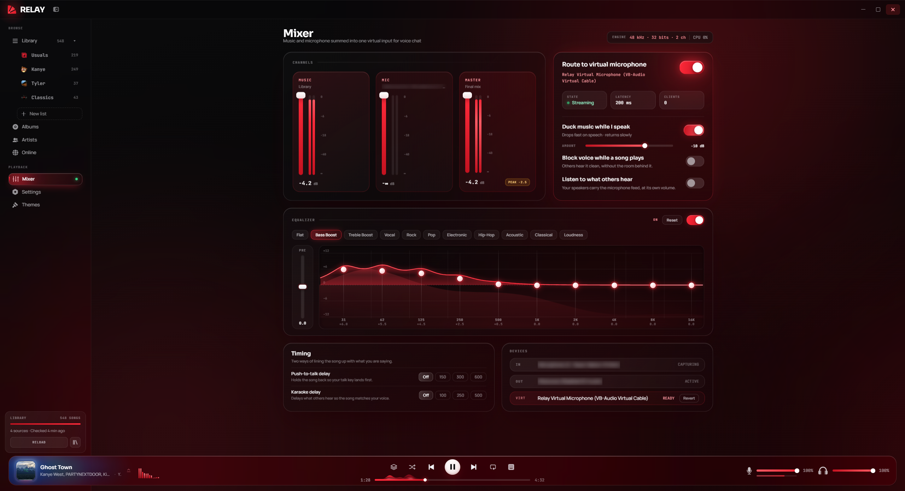
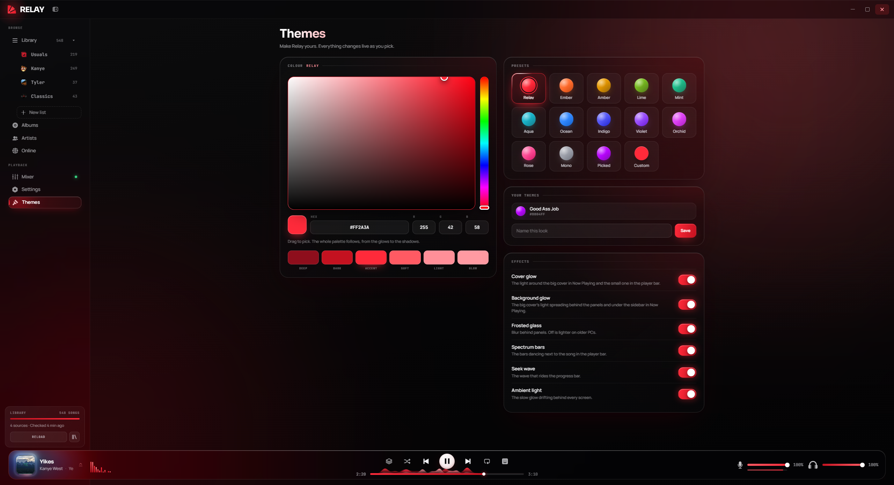

# Relay

Music and Soundboard in the same place, born to be one of the most complete music players.

[**Download Relay for Windows**](https://github.com/ElcocosYT/Relay/releases/latest/download/Relay-Setup.exe)

Relay updates itself: when a new version comes out, it tells you when you open it.

Made with love by SupperDupper. Free to download and use, with no ads.

## Screenshots

<table>
<tr><td width="50%" align="center"> Now Playing</td><td width="50%" align="center"> Library</td></tr>
<tr><td width="50%" align="center"> Albums</td><td width="50%" align="center"> Artists</td></tr>
<tr><td width="50%" align="center"> Online</td><td width="50%" align="center"> Mixer</td></tr>
<tr><td width="50%" align="center"> Themes</td></tr>
</table>

## License

© 2026 SupperDupper. All rights reserved.

Relay is free to download and use. Its code, design, artwork and interface are not open source: you may not copy, modify, redistribute or reuse them, in whole or in part, without written permission from SupperDupper.

